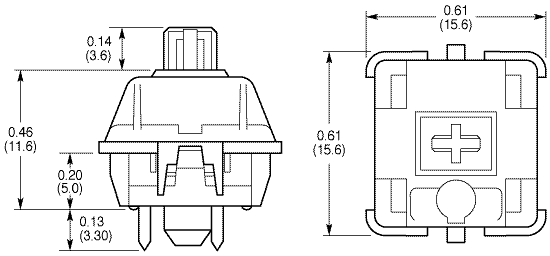
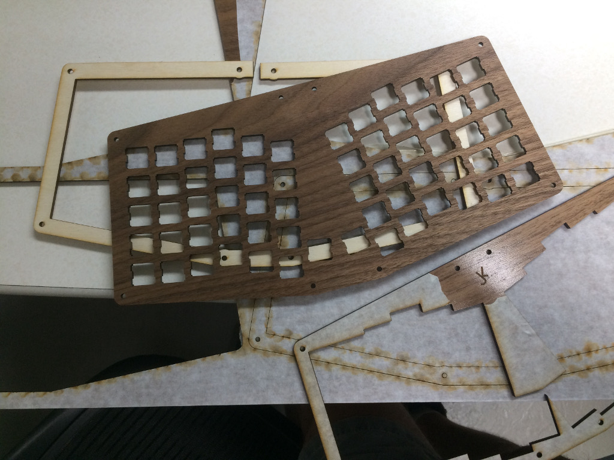
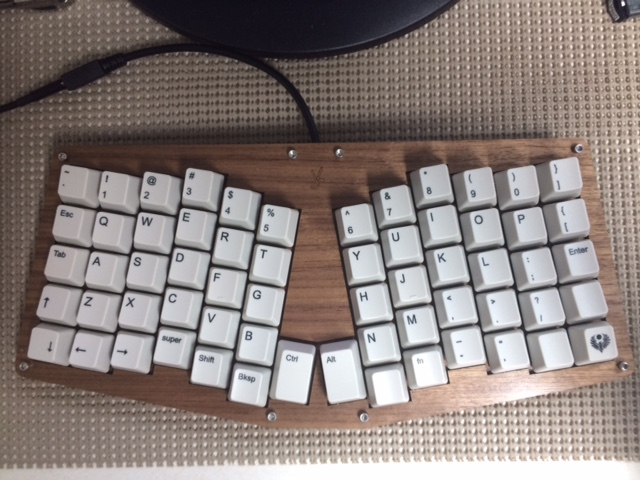
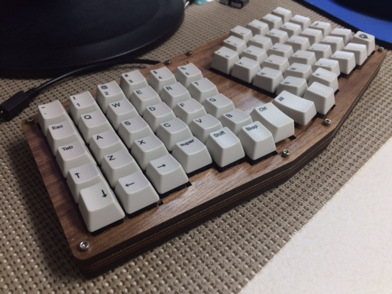
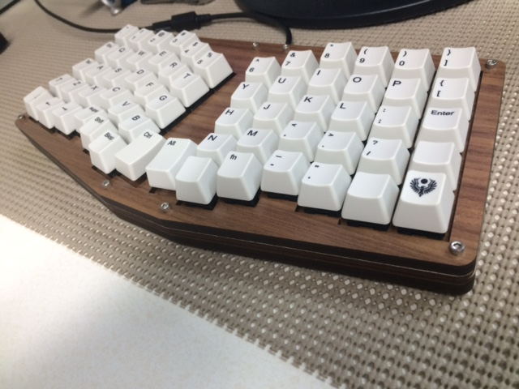

# FAQ

[Default Keymap from QMK project](https://github.com/qmk/qmk_firmware/blob/master/keyboards/atreus62/keymaps/default/keymap.c)

[KLE Layout of Default layer and Nav layer](http://www.keyboard-layout-editor.com/#/gists/ba3723e5507de945f8a2954fe8877d16)

# Build Guide for Atreus62

## Sourcing components

- Buy PCB and electronics from [Profet Keyboards](http://shop.profetkeyboards.com/product/atreus62-pcb)
- Cut case from [Ponoko Premium Walnut 3.5mm](https://www.ponoko.com/make-and-sell/show-material/598-premium-veneer-mdf-walnut#main-image) and [Birch Plywood 3.2mm](https://www.ponoko.com/make-and-sell/show-material/358-plywood-birch#main-image) for striped pattern
- Keyswitches?
- Keycaps?

## Making Case

Thinking to create walnut top, bottom, and middle and then lighter spacing layers (birch for cheapness?). Not even sure if contrast will be too visible with laser cut burns. It being plywood or mdf, how easy can I actually sand it? I think we need three spacing layers if done with thinner wood layers. Original case in acrylic is made with [one switch plate at 4.5mm thick, one spacer layer at 4.5mm thick, one 3mm spacer layer - for a total of 12mm under the keyswitch](https://github.com/profet23/atreus62/issues/1)

Keyswitch alone will take up 8.3mm under its crown. Or 3.8mm under the original switchplate. 

Teensy is maybe around 6mm thick? Anyway, we need around 12mm under the keyswitch crown it seems (not sure how much extra space left between teensy and bottom plate in original acrylic case...) 

So we need a top plate (walnut), switch plate (walnut 3.5mm), spacer (birch 3.2mm), spacer (walnut 3.5mm), spacer (birch 3.2mm), bottom (walnut) for a total of 13.4mm of usable space under the switch crown. So yeah, the middle spacer plate doesn't really have to be in walnut - since we'll just see the MDF edges... but there is the extra space for one more layer in the 24x12 sheet of Walnut, so why not. Maybe leave the MDF burnt and it will still be a decent contrast to the sanded birch plywood edges?

Ponoko offers very small (P1 - 181mmx181mm) and just right (24"x12" - 596mm x 291mm) sizes of their [Premium Walnut 3.5mm sheets](https://www.ponoko.com/make-and-sell/show-material/598-premium-veneer-mdf-walnut#main-image), so I managed to fit the top plate (with my initials engraved), the switch plate, a spacer, and the bottom plate on one sheet. Same sizes were offered in their [Birch Plywood 3.2mm](https://www.ponoko.com/make-and-sell/show-material/358-plywood-birch#main-image). I only needed two birch spacers, but had space left over for 2 more case layers, so chose to include an extra spacer in case I want to make an oreo case, and a top plate (with initials) just so I can see what a lighter case top would look like. With a $20 1st timer discount it came to just under $60 total. I somehow doubt I got this right the first time through, and even then, if you place any value on your own time - you're not saving money by making the case yourself. But it was fun to consider the look of the case and mess around with :-)

[Ponoko Design for 4 distinct layers in 3.5mm Premium Walnut Veneer MDF on 24"x12" sheet](ponoko/4layers-initials-24x12-3.5mmPremiumWalnut.svg) Cost: Estimated Making: $11.50, Material:	$28.00, Total: $39.50

[Ponoko Design for 3 spacers and 1 top plate in 3.2mm Birch Plywood on 24"x12" sheet](ponoko/1topPlateInitials-3spacers-24x12-3.2mmBirchPly.svg) Cost: Estimated Making: $11.60, Material: 	$9.50, Total:	$21.10

Hmm just ordered but it seems you can get by with just two spacer layers... [Imgur](http://i.imgur.com/Tp04rdk.jpg) & [Source Post](https://www.reddit.com/r/MechanicalKeyboards/comments/5m8lz1/earthy_atreus62/dc25ng3/) If I had seen this before I would have been more inclined to cut up one of the spacer layers in to 4 or so parts and cut them from the middle of the other spacer. Though my first timer discount of $20 more or less cancelled this out. But good to know in the future.

The two sheets arrived, all pictures located in the [images folder](images/). Below are some of the layers, in both walnut and birch

 
 ## Keyswitches 
 Hard to say. I like the tactile click, but I also don't hate my coworkers... So trying to decide between Cherry MX Browns and Clears. Or maybe splurge on some [65g R5 Zealios](https://zealpc.net/collections/switches/products/zealio)
 
 Went ahead and bought 70 [Cherry MX Clears from MechanicalKeyboards.com](https://mechanicalkeyboards.com/shop/index.php?l=product_detail&p=594)
 
 ## Keycaps
 I do love the look of the [1976 keycaps](https://www.reddit.com/r/MechanicalKeyboards/comments/4zk8ui/1976_on_my_60_atreus/), but perhaps just blanks or cheap keycaps just to get this working. 
 
 I will probably end up changing the keymap, but I got a [custom printed 104 set from WASD](http://www.wasdkeyboards.com/index.php/products/keycap-set/104-key-cherry-mx-keycap-set.html) with sideways printing for Ctrl and Alt keys and some bottom keys with text in R1 profile as well as flipped 180 degree R4 profile to try. And since I had some extra keys left over (space bar, CapsLock, etc) I printed some random keys for other keyboard. We'll see how they turn out!
 
 Update: They turned out really well! The caps for this keyboard were mostly text and simple images, so no problems at all. I printed some full images, and they all turned out great except for one full cap top image with a white background on a black cap.
 
 Annoying thing: Cherry MX Whites have fat stems! My keycaps wouldn't fit on them! I decided to file down these keycaps as I likely am not going to use them for any other keyboard, but now not sure what to do with future cap sets...
 
 ## Layout
[Keyboard-Layout-Editor.com example of Atreus62 I made](http://www.keyboard-layout-editor.com/#/gists/ba3723e5507de945f8a2954fe8877d16) 

[Guide to Edit Keymap](http://nickgreen.info/quick-guide-how-to-edit-keymap-on-atreus62/)

Cloned the qmk_firmware repo and made some edits to the [keymap](http://www.keyboard-layout-editor.com/#/gists/5868fe5cf5176031f1ffead25500a2b8) and flashed the new map with avrdude on linux `sudo avrdude -p atmega32u4 -c avr109 -U flash:w:atreus62_jkl20170514.hex -P /dev/ttyACM0`

## Cost

| Part                                    | Cost  |
| --------------------------------------- | -------- |
| Atreus62 PCB & Electronics + Shipping   | $62.98   |
| 70 Cherry MX Clears                     | $45.50   |
| Ponoko Making                           | $28.33   |
| Ponoko Materials (1 walnut & 1 plywood) | $37.50   |
| Ponoko Shipping                         | $13.81   |
| Ponoko 1st Timer Discount               | -$20.00  |
| Keycaps                                 | $50.00   |
| Keycaps Shipping                        | $14.60   |
| Keycaps Taxes                           | $4.63    |
| **Total**                               | **$237.35** |

## Final Outcome

Pretty happy with outcome :-) Will probably mess with keymap, mostly on nav layer though.

